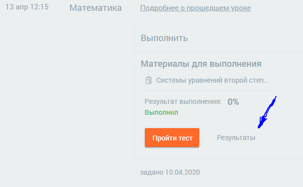
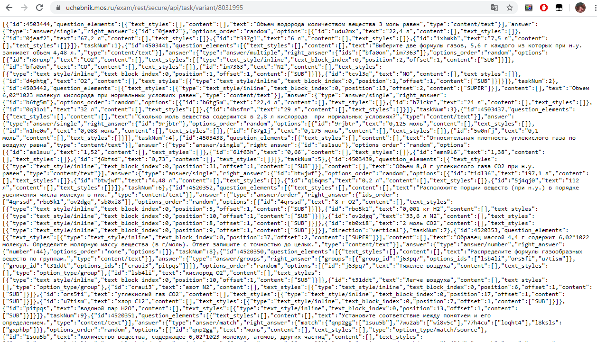
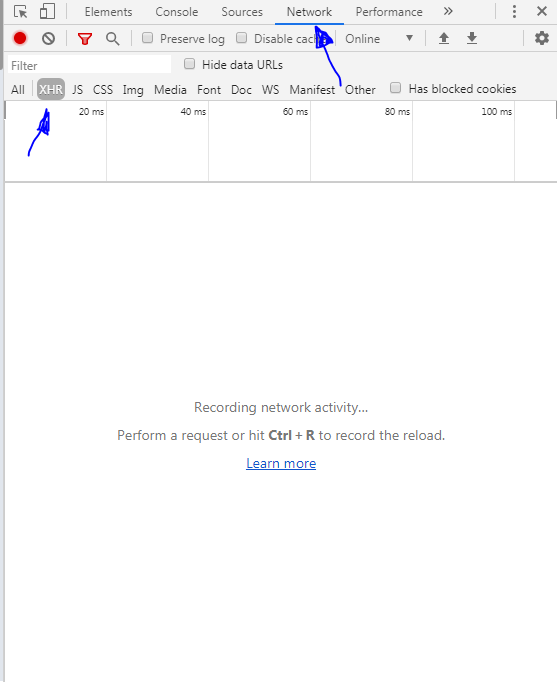
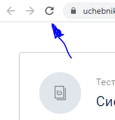
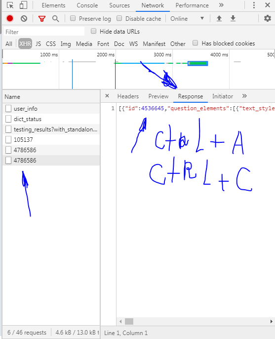
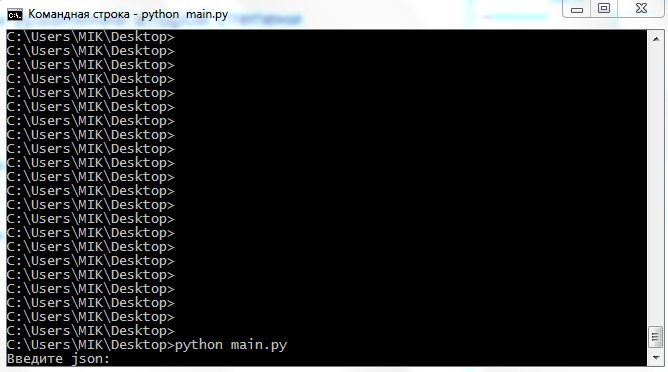

# mash

Скрипт для получения правильных ответов электронных тестов на платформе uchebnik.mos.ru

# Инструкция по получению json данных:

Начинаем делать тест, и копируем число которое светится после строки "variant"

Полученное число вставляем в ссылку: https://uchebnik.mos.ru/exam/rest/secure/api/task/variant/
В итоге должна получиться ссылка вот такого вида: https://uchebnik.mos.ru/exam/rest/secure/api/task/variant/8648706

Переходим по ссылке, и копируем весь текст который там есть (Ctrl+A; Ctrl+C)

Запускаем программу в интерпретаторе питона

Вставляем скопированное заранее значение

PROFIT!!!

