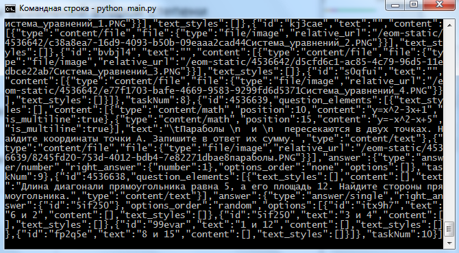

# mash-ans-getter

Скрипт для получения правильных ответов электронных тестов на платформе uchebnik.mos.ru

# Инструкция по получению json данных:

Заходим на сайт dnevnik.mos.ru далее в домашнее задание с нужным, заранее выполненным тестом. Там тыкаем на кнопочку "результаты"

Заходим в дебаг консоль с пмощью кнопки F12

Там идём во вкладку "Network" далее "XHR"

Перехагружаем страничку

В дебаг меню во вкладке "Responce" ищем самый последний файл и копируем его содержимое 

Запускаем скрипт

Вводим заранее полученное содержимое, и PROFIT!!!

